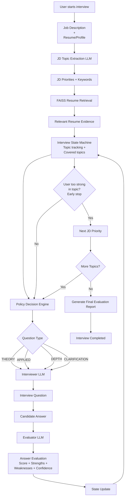

# Cognix AI


A **hybrid state–LLM interview simulation platform** that conducts structured interviews using retrieval-augmented context and a deterministic interview controller.

Unlike typical AI interview tools that rely purely on prompts, Cognix uses a **state machine and policy engine** to orchestrate LLM agents and maintain a stable interview flow. The system extracts evaluation topics from job descriptions, retrieves relevant resume evidence, generates adaptive questions, evaluates answers in real time, and produces a structured post-interview report with topic-wise performance analysis.

---

## Demo

*(Short walkthr ough of the interview flow, evaluation and other features)*

https://github.com/user-attachments/assets/98e2a4be-788b-479b-8a7b-352be13e70d3

---

## Key Highlights

• **State-Machine Interview Engine** – deterministic interview control instead of LLM-driven conversations  
• **Policy-based question strategy** – adaptive question types based on candidate performance  
• **Retrieval-augmented context** – questions grounded in resume + job description evidence  
• **Semantic evaluation pipeline** – strengths/weaknesses clustered and aggregated into a final report  
• **Token-efficient prompt orchestration** – selective context injection for cheaper and faster inference  
• **Stateless LLM calls** – backend maintains interview state instead of the model

---

## Key Features

* Up to 100 **free interviews** per day using a Groq API key
* **Multi-agent architecture** with fast responses (~1s per turn)
* **Configurable interview behavior** through policies and thresholds
* **Resume + job description driven questioning**
* **Adaptive questioning** (theory / applied / depth / clarification)
* **Real-time answer evaluation**
* **Topic-wise scoring and structured report generation**
* **Interview transcript and history tracking**
* **Modern cyber-style UI**
* **Dockerized environment for reproducible execution**

---

## Tech Stack

**Frontend:** HTML, Jinja, CSS, JavaScript, Chart.js  
**Backend:** Python, FastAPI, Pydantic, Scikit-learn  
**LLM Integration:** Groq API, AutoGen  
**Retrieval:** FAISS, Sentence Transformers, pdfplumber  
**Storage:** SQLite  
**Infrastructure:** Docker, Docker Compose

---

## Installation

### Prerequisites

- Git
- Python 3.10+ (for local run)
- Docker Desktop (for Docker run)
- Groq API Key [Link](https://console.groq.com/keys)

### Clone the Repository

```bash
> git clone <https://github.com/Priyansh143/Cognix-AI>
> cd Cognix-AI
````

## Run the Application

You can run the project in two ways.

### Option 1 — Run with Python

```bash
python run.py
```

This will automatically:

* create a virtual environment if it does not exist
* install the required dependencies
* start the FastAPI server
* Press Ctrl + C in terminal to close.

Open the application in your browser:

```bash
http://localhost:8000
```

---

### Option 2 — Run with Docker
<details>
<summary> Click to expand </summary>
Build the Docker image:

```bash
docker build -t interview-ai .
```

Start the application using Docker Compose:

```bash
docker compose up
```

Open the application in your browser:

```bash
http://localhost:8000
```

### Stop the Application

```bash
docker compose stop
```

To remove the container:

```bash
docker compose down
```

The interview data stored in the Docker volume will remain unless the volume is removed manually.

</details>

---

## Interview Engine Architecture

The interview flow is not driven by a single LLM prompt.  
Instead, the system uses a **hybrid LLM–State architecture** that combines deterministic backend logic, retrieval, and targeted LLM calls.

### 1. Topic Extraction from the Job Description

- Before the interview begins, an LLM extracts the most important interview topics from the job description.

- The output becomes a prioritized topic list (`jd_priorities`) with topic-specific keywords.

- These extracted keywords are also used to retrieve relevant resume evidence from FAISS.

### 2. Retrieval-Augmented Context

For each topic:

- resume chunks are embedded and stored in FAISS
- topic keywords are used to retrieve relevant evidence
- only the most useful evidence is injected into the prompt

This keeps the interview grounded in the candidate’s actual profile and reduces unnecessary token usage.

### 3. State-Driven Interview Controller

The interview is controlled by a deterministic `InterviewState` object that tracks:

- current topic / JD priority
- question count per topic
- previous satisfaction score
- confidence level
- covered topics
- retrieved resume evidence
- full interview history

This prevents the interview from being guided purely by LLM behavior.

### 4. Policy-Based Question Strategy

The backend decides the next question type using a policy engine.

Possible question types include:

- `THEORY`
- `APPLIED`
- `CLARIFICATION`
- `DEPTH`

The next action is selected using the previous answer quality and topic-level policy weights.  
This makes the interview adaptive but still predictable and structured.

### 5. LLM as a Component, Not the Controller

The LLM is used for language-heavy tasks:

- extracting JD topics
- generating interviewer questions
- evaluating candidate answers

The backend determines the flow, topic progression, and question strategy.  
This keeps the interview stable, economical, and less dependent on unpredictable model behavior.

### 6. Token-Efficient Design

To minimize token usage, the system injects only the context required for the current turn:

- current JD priority
- retrieved resume evidence
- selective history when needed
- current interview state

This design allows the system to work well even with weaker or lower-cost LLMs.

---

## System Architecture



### Evaluation & Reporting Pipeline
<details>
<summary>Click to expand</summary>

```mermaid
flowchart TD
    A[Interview Turns Stored in SQLite]
    A --> B[Load Satisfaction, Confidence, Strengths, Weaknesses]
    B --> C[Confidence Weighted Scoring]
    C --> D[Topic-wise Score Aggregation]
    D --> E[Strength & Weakness Phrase Collection]
    E --> F[Semantic Clustering<br/>Sentence-Transformer Embeddings]
    F --> G[Cluster Representative Phrases]
    G --> H[Top Strengths & Weaknesses Selected]
    H --> I[Structured Evaluation Data]
    I --> J[LLM Human-Readable Report]
    J --> K[Final Interview Report Stored]
 ```
</details>

## Screenshots from UI
<details>
<summary> Click to expand </summary>


### Home Screen


### Interview in Progress


### Evaluation Report


### Transcript Modal


### Profile Screen


### Past Interviews


### Config Screen


</details>

---

## Components

<details>
<summary> Click to expand </summary>
The system is organized around five main components:

* **User**: Starts the interview, answers questions, reviews results, and opens the transcript.
* **Frontend**: Handles UI state, settings, interview chat, loading screens, report display, and transcript modal.
* **Backend**: Orchestrates session setup, state management, retrieval, question generation, answer evaluation, and persistence.
* **LLM**: Generates interview questions and evaluation summaries.
* **Database**: Stores session data, interview turns, evaluation output, and history.


Evaluation Engine is part of backend, separately shown for better understanding.

</details>

---

## Sequence Diagram

<details>
<summary> Click to expand </summary>

> This diagram shows the complete interview lifecycle, from session setup to transcript review.


</details>

---

## Project Structure

<details>
<summary> Click to expand </summary>


```text
.
project-root/
├── backend/
│   ├── agents.py
│   ├── analysis.py
│   ├── app.py
│   ├── interview_setup.py
│   ├── interview_controller.py
│   ├── controller_runner.py
│   ├── faiss_index.py
│   ├── models.py
│   ├── profile_loader.py
│   ├── resume_extractor.py
│   ├── embeddings.py
│   ├── database.py
│   ├── logger.py
│
├── frontend/
│   ├── static/
│   │   ├── assets/
│   │   └── script.js
│   │   └── style.css
│   ├── templates/
│   │   └── index.html
│
├── data/
│   └── uploads/
│   └── interviews.db
│   └── profile.json
|
├── .env
├── docker-compose.yml
├── Dockerfile
├── requirements.txt
├── run.py
├── .gitignore
├── .dockerignore
├── config.yaml
└── README.md
└── LICENSE
```
</details>

---

## API Endpoints
<details>
<summary> Click to expand </summary>

```text
WEBSOCKET /ws/interview/{session_id}
POST /setup
POST /profile
POST /api_key
GET  /evaluation/{sessionId}
GET  /evaluation-nollm/{sessionId}
GET  /transcript/{sessionId}
GET /interviews
GET /profile
GET /config
```

Responsibilities:

* `WEBSOCKET /ws/interview/{session_id}` — Run the interview session.
* `POST /setup` — initialize interview settings and session data
* `POST /profile` — saves profile changes.
* `POST /api_key` — Saves api key persistently.
* `GET /evaluation/{sessionId}` — fetch the final report with LLM output
* `GET /evaluation-nollm/{sessionId}` — fetch the final report without LLM
* `GET /transcript/{sessionId}` — fetch interview transcript data
* `GET /interviews` — fetch interviews table to view past interviews.
* `GET /profile` — fetch user profile.
* `GET /config` — fetch default configs.

</details>

---

## Future Improvements

* Deployed Web-Application
* Voice enabled interviews using TTS-STT models.
* Additional interviewer states and policies
* More types of interviews (Eg- Technical, aptitude, cultural fit, etc) 
* Camera enabled interview with timer.
* Expanded admin or history dashboard
* User's overall skill tracking and analysis
* Exportable PDF report

## Known Limitations

* The project depends on external LLM responses from groq.
* Evaluation quality may vary based on model output.
* The retrieval quality depends on the resume/profile data provided.


## Contributing

Contributions are welcome.

1. Fork the repository.
2. Create a feature branch.
3. Commit your changes.
4. Open a pull request.


## License

This project is licensed under the MIT License.

See the [LICENSE](LICENSE) file for details.

